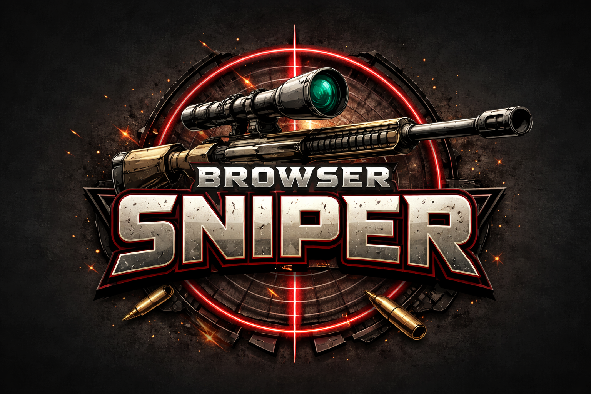

Link to play: [Browser Sniper Game](https://gitty398.github.io/sniper-browser-game/)

# Browser Sniper

The marksmanship simulator testing your mental math abilities!

**Description**

* Browser Sniper is a realistic marksmanship simulator that allows players to test thier skills determining *elevation holds* and *wind calls* given a specific target and wind conditions.

* Elevation holds are the amount of elevation you are adding to your scope (up and down) and wind calls consist of both a direction (left, right or center) and a number of *mils* (mils are a unit of measurement for shooting).

* Players will be presented with a target and be given it's distance and the current wind conditions. With that data, players will input the elevation hold and wind call that they believe will be needed to hit the target.

* Once ready, a player will hit the ***Fire Button*** to see (or hear) if their round will strike the target.

* Players must hit **8 out of 10 targets** to win the game and are only provided 15 rounds.

# Background Info

* I chose to create this game because it provides the most realistic simulation of what "sniping" or long-range shooting actually consists of and as a practicioner of long-range shooting myself, I wanted to focus on practicing progamming skills without having to worry about learning a new game's logic. I also wanted to program something that myself and other long-range marksman can enjoy to practice our mental math.

# Technologies Used

* JavaScript, HTML, CSS, VS Code. Also credit to OpenAI for generating the Browser Sniper logo.

# Next Steps/ Sretch Goals

* The current game is a slimmed-down version of what I originally wanted. The two aspects that I would have liked incorporated are non-linear elevation holds and randomized targets. Now that version one of the game is complete, adding these two aspects to future versions wouldn't be very hard. However when playing the game multiple times during the de-bugging process, having randomized targets would have been a nightmare!

